

<a href='/APE/assets/BonCommandeBijou_1024.pdf' target='_blank'>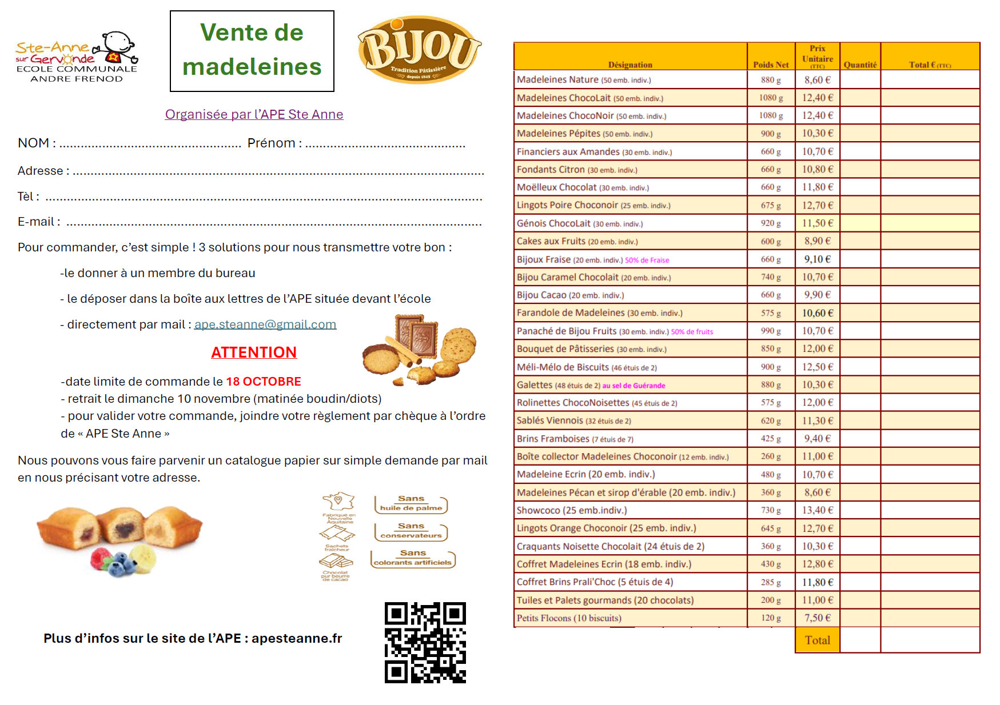</a>

<a href='/APE/assets/BijouRecto_1024.pdf' target='_blank'>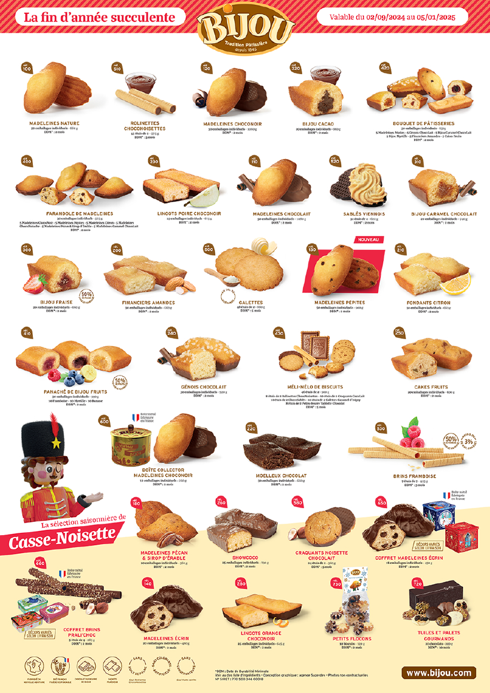</a>
<a href='/APE/assets/BijouVerso_1024.pdf' target='_blank'>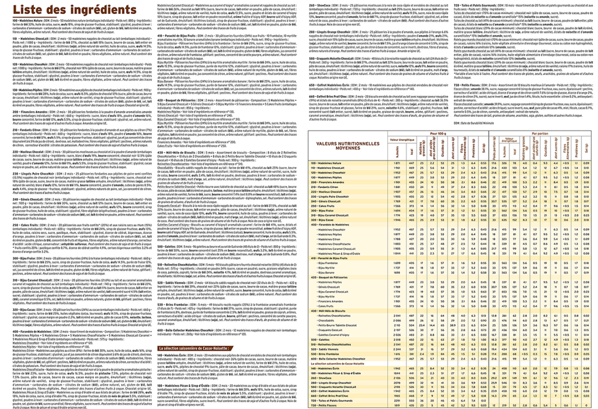</a>

  Voici la liste des produits et leur tarif

  <table >
    <tr>
      <th>
        MADELEINES NATURE 
        <i>Madeleines nature 
        Présentation boîte carton 
        Dim. L. : 23,5 x l. : 19,5 x h. : 17,5 cm 
        Poids net : 880 g 
        50 emballages individuels</i>
      </th>
      <th width="200" height="200">
        
      </th>
      <th>8,60€</th>
    </tr>
    <tr>
      <th>
        MADELEINES CHOCOLAIT 
        <i>Madeleines nappées de chocolat au lait 
        Présentation boîte carton 
        Dim. L. : 23,5 x l. : 19,5 x h. : 17,5 cm 
        Poids net : 1080 g 
        50 emballages individuels </i>
      </th>
      <th>
        
      </th>
      <th>12,40€</th>
    </tr>
    <tr>
      <th>
        MADELEINES CHOCONOIR 
        <i>Madeleines nappées de chocolat noir 
        Présentation boîte carton 
        Dim. L. : 23,5 x l. : 19,5 x h. : 17,5 cm 
        Poids net : 1080 g  
        50 emballages individuels </i>
      </th>
      <th>
        
      </th>
      <th>12,40€</th>
    </tr>
    <tr>
      <th>
        MADELEINES PEPITES 
        <i>Madeleines aux pépites de chocolat 
        Présentation boîte carton 
        Dim. L. : 23,5 x l. : 19,5 x h. : 17,5 cm 
        Poids net : 900 g  
        50 emballages individuels </i>
      </th>
      <th>
        
      </th>
      <th>10,30€</th>
    </tr>
    <tr>
      <th>
        FINANCIERS AUX AMANDES 
        <i>Pâtisseries fondantes à la poudre d'amande aromatisées amande amère 
        Présentation boîte carton 
        Dim. L. : 23,5 x l. : 19,5 x h. : 8 cm 
        Poids net : 660 g  
        30 emballages individuels</i>
      </th>
      <th>
        
      </th>
      <th>10,70€</th>
    </tr>
    <tr>
      <th>
        FONDANTS CITRON 
        <i>Pâtisseries fondantes à la poudre d’amande et aux pépites au citron (7%) 
        Présentation boîte carton 
        Dim. L. : 23,5 x l. : 19,5 x h. : 8 cm 
        Poids net : 660 g  
        30 emballages individuels</i>
      </th>
      <th>
        
      </th>
      <th>10,80€</th>
    </tr>
    <tr>
      <th>
        MOELLEUX CHOCOLAT 
        <i>Pâtisseries moelleuses au chocolat et à la poudre d’amande 
        Présentation boîte carton 
        Dim. L. : 23,5 x l. : 19,5 x h. : 8 cm 
        Poids net : 660 g  
        30 emballages individuels</i>
      </th>
      <th>
        
      </th>
      <th>11,80€</th>
    </tr>
    <tr>
      <th>
        LINGOTS POIRE CHOCONOIR 
        <i>Pâtisseries fondantes aux pépites de poire semi confites (14%) nappées de chocolat noir 
        Présentation boîte carton 
        Dim. L. : 23,5 x l. : 19,5 x h. : 8 cm 
        Poids net : 675 g 
        25 emballages individuels</i>
      </th>
      <th>
        
      </th>
      <th>12,70€</th>
    </tr>
    <tr>
      <th>
        GENOIS CHOCOLAIT 
        <i>Pâtisseries nappées de chocolat au lait 
        Présentation boîte carton 
        Dim. L. : 23,5 x l. : 19,5 x h. : 11,5 cm 
        Poids net : 920 g  
        30 emballages individuels</i>
      </th>
      <th>
        
      </th>
      <th>11,50€</th>
    </tr>
    <tr>
      <th>
        CAKES AUX FRUITS 
        <i>Pâtisseries aux fruits confits* (20%) et aux raisins secs au rhum (15%) 
        Présentation boîte carton 
        Dim. L. : 23,5 x l. : 19,5 x h. : 8 cm 
        Poids net : 600 g 
        20 emballages individuels</i>
      </th>
      <th>
        
      </th>
      <th>8,90€</th>
    </tr>
    <tr>
      <th>
        BIJOU FRAISE 
        <i>Pâtisseries fourrées (24%) à la fraise 
        Présentation boîte carton 
        Dim. L. : 23,5 x l. : 19,5 x h. : 8 cm 
        Poids net : 660 g  
        20 emballages individuels</i>
      </th>
      <th>
        
      </th>
      <th>9,10€</th>
    </tr>
    <tr>
      <th>
        BIJOU CARAMEL CHOCOLAIT 
        <i>Pâtisseries fourrées (21.6%) au lait et au caramel aromatisées caramel et nappées de chocolat au lait 
        Présentation boîte carton 
        Dim. L. : 23,5 x l. : 19,5 x h. : 8 cm 
        Poids net : 740 g 
        20 emballages individuels</i>
      </th>
      <th>
        
      </th>
      <th>10,70€</th>
    </tr>
    <tr>
      <th>
        BIJOU CACAO 
        <i>Pâtisseries fourrées (24%) au cacao 
        Poids net : 660 g 
        20 emballages individuels</i>
      </th>
      <th>
        
      </th>
      <th>9,90€</th>
    </tr>
    <tr>
        <th>
          FARANDOLE DE MADELEINES 
          <i>Assortiment de madeleines 
          Présentation boîte carton 
          Dim. L. : 23,5 x l. : 19,5 x h. : 11,5 cm 
          Poids net : 575 g 
          6x5 emballages individuels</i>
        </th>
        <th>
          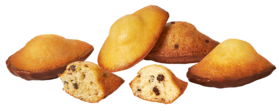
        </th>
        <th>10,60€</th>
      </tr>
      <tr>
        <th>
          PANACHE DE BIJOU FRUITS 
          <i>Pâtisseries fourrées (24%) aux fruits - 10 banane aromatisées banane, 10 framboise, 10 myrtille aromatisées myrtille 
          Une nouvelle composition régale les beaux jours gourmands. Notre Bijou Banane vient compléter cet assortiment. 
          Présentation boîte carton 
          Dim. L. : 23,5 x l. : 19,5 x h. : 11,5 cm 
          Poids net : 990 g 
          30 emballages individuels</i>
        </th>
        <th>
          
        </th>
        <th>10,70€</th>
      </tr>
      <tr>
        <th>
          BOUQUET DE PATISSERIES 
          <i>Assortiment de Pâtisseries 
          Présentation boîte carton 
          Dim. L. : 23,5 x l. : 19,5 x h. : 11,5 cm 
          Poids net : 850 g 
          30 emballages individuels</i>
        </th>
        <th>
          
        </th>
        <th>12€</th>
      </tr>
      <tr>
        <th>
          MELI-MELO DE BISCUITS 
          <i>Assortiment de biscuits fins 
          Présentation boîte carton 
          Dim. L. : 23,5 x l. : 19,5 x h. : 11,5 cm 
          Poids net : 900 g 
          46 étuis de 2</i>
        </th>
        <th>
          
        </th>
        <th>12,50€</th>
      </tr>
      <tr>
        <th>
          GALETTES 
          <i>Galettes pur beurre au sel de Guérande 
          Présentation boîte carton 
          Dim. L. : 23,5 x l. : 19,5 x h. : 8 cm 
          Poids net : 880 g  
          48 étuis de 2</i>
        </th>
        <th>
          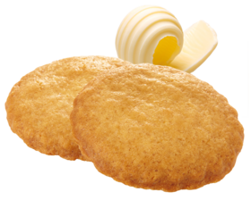
        </th>
        <th>10,30€</th>
      </tr>
      <tr>
        <th>
          ROLINETTES CHOCONOISETTES 
          <i>Biscuits pâtissiers fourrés chocolat noisette (55%) 
          Présentation boîte carton 
          Dim. L. : 23,5 x l. : 19,5 x h. : 5 cm 
          Poids net : 575 g  
          45 étuis de 2</i>
        </th>
        <th>
          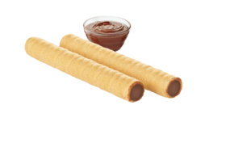
        </th>
        <th>12€</th>
      </tr>
      <tr>
        <th>
          SABLES VIENNOIS 
          <i>Biscuits sablés nappés de chocolat noir 
          Présentation boîte carton 
          Dim. L. : 23,5 x l. : 19,5 x h. : 8 cm 
          Poids net : 620 g 
          32 étuis de 2</i>
        </th>
        <th>
          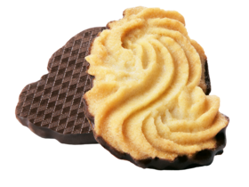
        </th>
        <th>11,30€</th>
      </tr>
      <tr>
        <th>
          BRINS FRAMBOISE 
          <i>Biscuits roulés nappés (35%) à la framboise aromatisés framboise 
          Présentation boîte carton 
          Dim. L. : 9 x l. : 9,8 x h. : 19,5 cm  
          Poids net : 425 g  
          7 étuis de 7 brins</i>
        </th>
        <th>
          
        </th>
        <th>9,40€</th>
      </tr>
      <tr>
        <th>
          BOITE COLLECTOR MADELEINES CHOCONOIR 
          <i>Madeleines nappées de chocolat noir 
          Présentation boîte métal collector 
          Dim. : diam. 15,4 x h. 13 cm 
          Poids net : 260 g  
          12 emballages individuels</i>
        </th>
        <th>
          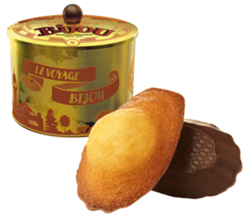
        </th>
        <th>11€</th>
      </tr>
      <tr>
        <th>
          MADELEINES ECRIN 
          <i>Madeleines aux pépites de chocolat enrobés de chocolat noir 
          Les Madeleines Ecrin quittent leur écrin de métal pour retrouver la chaleur du carton. Une bonne occasion de refaire le plein de vos belles boîtes collector BIJOU !  
          Poids net : 480 g 
          20 emballages individuels</i>
        </th>
        <th>
          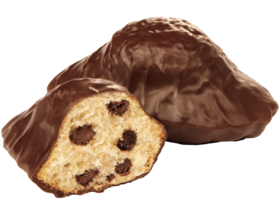
        </th>
        <th>10,70€</th>
      </tr>
      <tr>
        <th>
          MADELEINES PECAN ET SIROP D'ERABLE 
          <i>Madeleines au sirop d'érable et aux éclats de pécan 
          Une jolie madeleine dorée au sirop d'érable et agrémentée de pécan. 
          Poids net : 360 g 
          20 emballages individuels</i>
        </th>
        <th>
          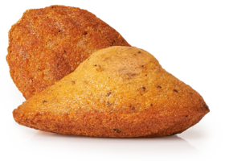
        </th>
        <th>8,60€</th>
      </tr>
      <tr>
        <th>
          SHOWCOCO 
          <i>Pâtisseries moelleuses à la noix de coco râpée et enrobées de chocolat au lait 
          La star Bijou, celui que tous les gourmands s’arrachent et qui vous fait fondre dès la première bouchée fait son retour… le ShowCoco est de nouveau disponible, pour le plus grand plaisir de tous ! Présentation boîte carton - Dim. : L. 23,5 x l. 19,5 x h. 8 cm 
          Poids net : 730 g 
          25 emballages individuels</i>
        </th>
        <th>
          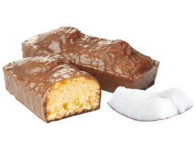
        </th>
        <th>13,40€</th>
      </tr>
      <tr>
        <th>
          LINGOTS ORANGE CHOCONOIR 
          <i>Pâtisseries à la poudre d'amande, aux pépites à l'orange 6.6% nappées de chocolat noir 
          Un gâteau fondant réhaussé d'une orange gourmande et talonné de chocolat. Le gâteau parfait pour les fêtes !  
          Poids net : 645 g 
          25 emballages individuels</i>
        </th>
        <th>
          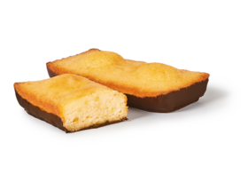
        </th>
        <th>12,70€</th>
      </tr>
      <tr>
        <th>
          CRAQUANT NOISETTE CHOCOLAIT 
          <i>Biscuits à la noisette nappés de chocolat au lait 
          Un savoureux biscuit craquant à la noisette talonné d'un gourmand chocolat au lait  
          Poids net : 360 g 
          24 étuis de 2</i>
        </th>
        <th>
          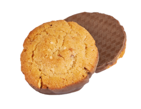
        </th>
        <th>10,30€</th>
      </tr>
      <tr>
        <th>
          COFFRET MADELEINES ECRIN 
          <i>Madeleines aux pépites de chocolat enrobées de chocolat noir 
          LA Madeleine star fait son grand retour, présentée dans son magnifique écrin de métal fabriqué en France. 
          Poids net : 430 g 
          18 étuis individuel</i>
        </th>
        <th>
          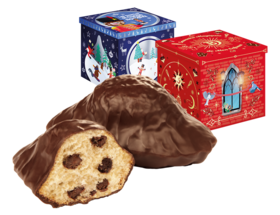
        </th>
        <th>12,80€</th>
      </tr>
      <tr>
        <th>
          COFFRET BRINS PRALI'CHOC 
          <i>Biscuits enrobés de chocolat au lait avec nappage saveur nougatine (19%) et éclats de noisette caramélisés (8%) 
          Des éclats de noisette caramélisés saupoudrés sur toute sa longueur… un choc de croustillants et de saveurs à tomber à la renverse ! C'est bien lui, le Brin de Prali'Choc fait son retour ! Présentation boîte métal - Dim. : L. 19 x l. 12,5 x h. 5 cm - Décors non contractuels  
          Poids net : 285 g 
          5 étuis de 4</i>
        </th>
        <th>
          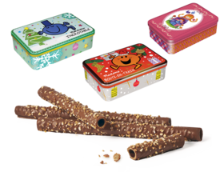
        </th>
        <th>11,80€</th>
      </tr>
      <tr>
        <th>
          TUILE ET PALETS GOURMANDS 
          <i>Assortiment de tuiles et palets gourmands au chocolat et fruits secs 
          Un assortiment de Tuiles et Palets gourmands au chocolat, présenté dans un joli ballotin décoré, voilà une bonne idée pour compléter vos listes de Noël.  
          Poids net : 200 g 
          Sachet de 10 flocons</i>
        </th>
        <th>
          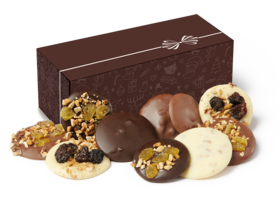
        </th>
        <th>11€</th>
      </tr>
      <tr>
        <th>
          PETITS FLOCONS 
          <i>Assortiment de biscuits moelleux à l'amande 
          De savoureux biscuits typiques, pour savourer cette fin d'année avec gourmandise.  
          Poids net : 120 g 
          Sachet de 10 flocons</i>
        </th>
        <th>
          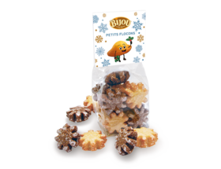
        </th>
        <th>7,50€</th>
      </tr>
  </table>

