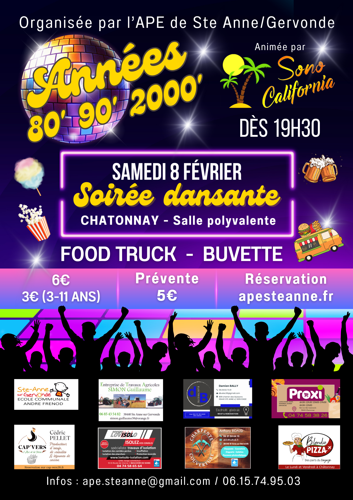
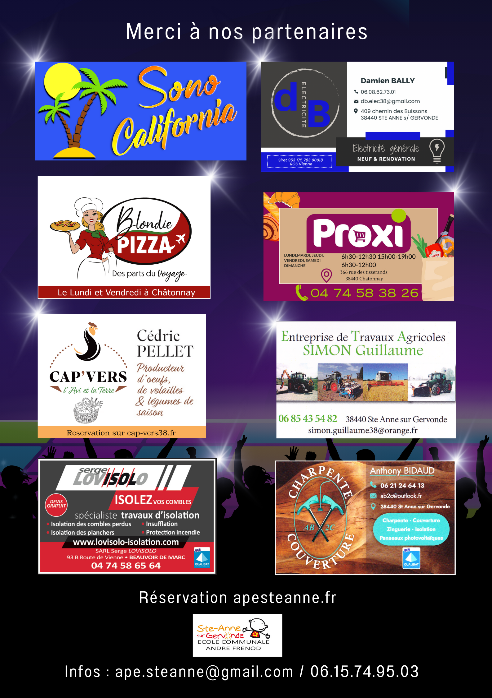
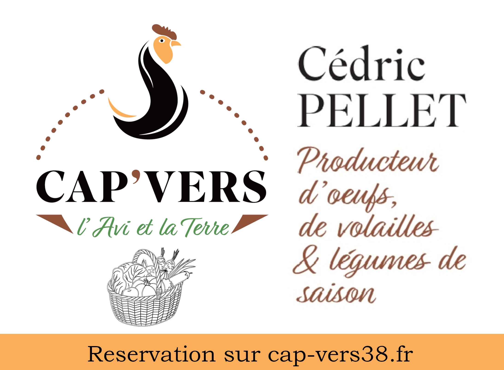

<h4>Soirée Dansante le samedi 8 février !</h4>
<h5>Salle polyvalente de Châtonnay - dés 19h30</h5>

Venez passer un moment convivial et festif pour une soirée animée par Sono California, DJ réputé dans la région.

<table>
    <tr>
      <th width="400">
        
      </th>
      <th width="400">
        
      </th>      
    </tr>
</table>

<h6>Tarifs :</h6>
<ul>
<li>6€ l'entrée par adulte (ou enfant +12 ans) / <b>5€ en prévente</b></li>
<li>3€ l'entrée pour les 3-11 ans</li>
<li>gratuit pour les -3 ans</li>
</ul>

<h6>Réserver vos places en prévente pour un tarif réduit à 5€ :  </h6>
<h5><a href="https://framaforms.org/soiree-disco-du-8-fevrier-1736592256" target="_blank"> -> Soit via ce formulaire</a></h5>
<h5><a href="mailto:ape.steanne@gmail.com" target="_blank"> -> Soit par mail à ape.steanne@gmail.com</a></h5>

<h5>Nos partenaires :</h5>

  <table>
    <tr>
      <th width="400">
        
      </th>
      <th width="400">
        
      </th>      
    </tr>
    <tr>
      <th>
        
      </th>
      <th>
        
      </th>
    </tr>
    <tr>
      <th>
        
      </th>
      <th>
        
      </th>
    </tr>
    <tr>
      <th>
        
      </th>
      <th>
        
      </th>
    </tr>
  </table>

