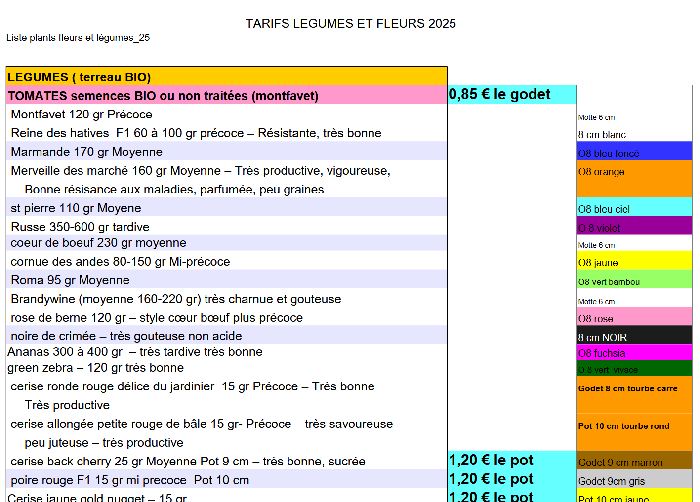

Christine Collomb et l’APE vous proposent un partenariat du 19 Avril au 21 Juin.
Elle se situe au 44 impasse des Serres, Vollandière, 38440 Chatonnay.

Ouvert :
 - de 9h à 12h et de 14h à 18h30 du lundi au samedi  
 - de 9h à 12h le dimanche en mai.

Pensez-y pour fleurir vos cours, massifs ...  🌸🌹🪻💐 🌷
Vous trouverez de quoi remplir votre jardin🌹🌷, votre potager 🍎 🫑 , et même des compositions pour la fête des mamans…. 💐 🎁

Lors de vos achats, n’hésitez pas à dire à Christine que vous venez de la part de l'École de Ste Anne. 
10% des ventes seront reversés pour les sorties des enfants.
  
<a href ="/APE/assets/Liste plants fleurs et légumes_25.pdf" target="_blank">
Voici la liste des différents produits en PDF

</a>

