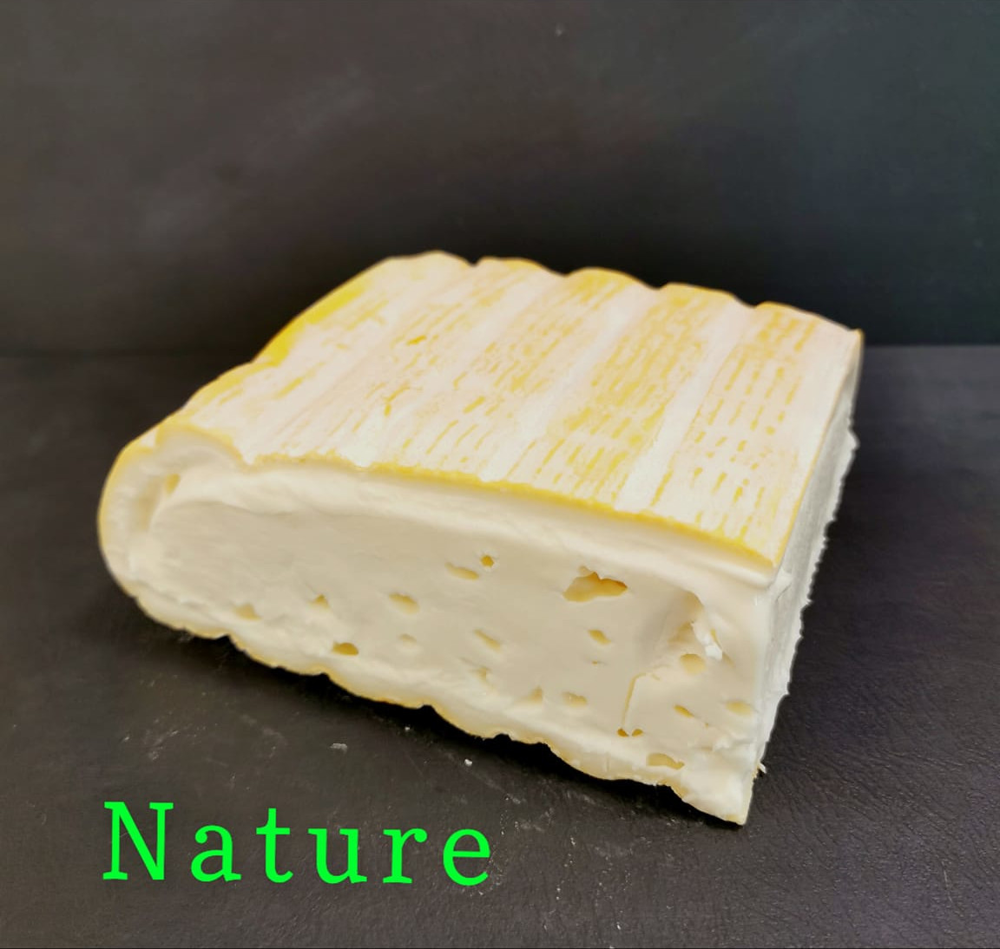

<h5>Vous pourrez retirer votre commande le vendredi 13/12 à partir de 16h à la grange située à côté de la salle des fêtes et de l'école de Ste-Anne, 
ou bien lors de la soirée Oika Oika à partir de 18h à la salle des fêtes.</h5>

<h5>Une nouvelle commande groupée de bons fromages d'Arinthod est en cours :</h5>

Il y a bien sur du comté, du morbier, de la raclette, des monts d'or, des pots de cancoillotte, mais aussi leur spécialité, le "Moelleux d'Arinthod" qui a un peu la texture d'un reblochon.

Nous avons également laissé à la vente des fromages découverts l'année dernière et qui ont bien plu comme le fondant "Bleu de la marre" et la tomme du Jura "Juradélice" à l'ail des ours.

Les produits à la coupe peuvent avoir des fluctuations de poids de 5%.

Possibilité de recevoir certains fromages sous vide avec un supplément de 0,50€ par produit. 

<h5>
Voici le bon de commande à nous retourner avant le vendredi 29 Novembre
pour une distribution mi-décembre :
</h5>
(Cliquer pour télécharger)

<h5>Vous allez vous régaler !</h5>

  

<table>
    <tr >
        <th width='300'>
          
        </th>
        <th width='300'>
          
        </th>        
      </tr>
      <tr>
        <th width='300'>
          
        </th>
        <th width='300'>
          
        </th>
      </tr>
  </table>

