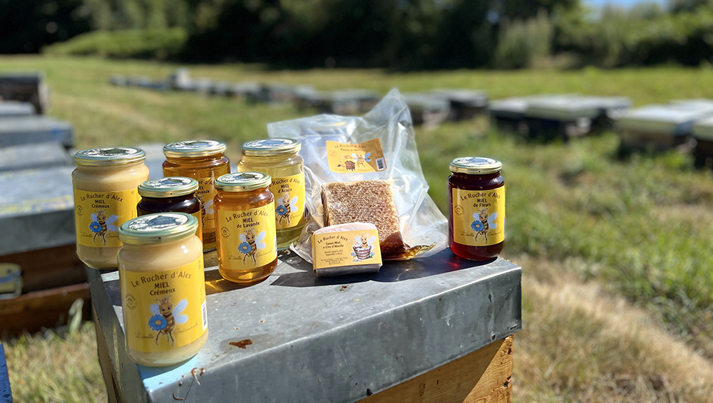
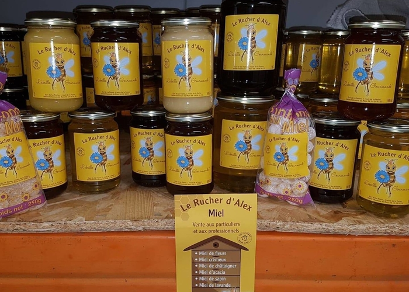
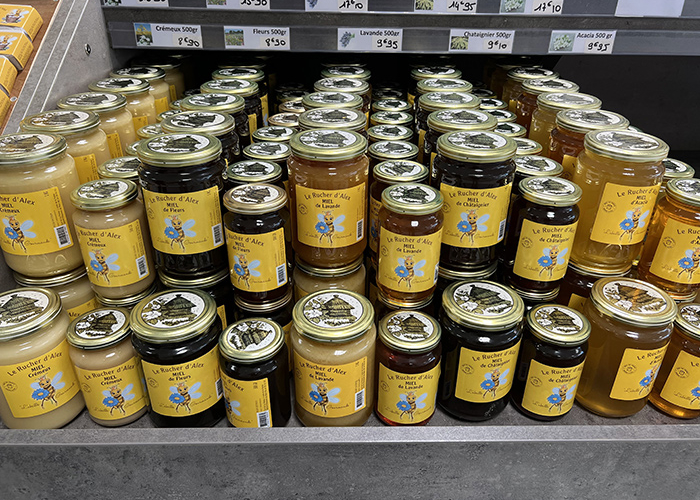
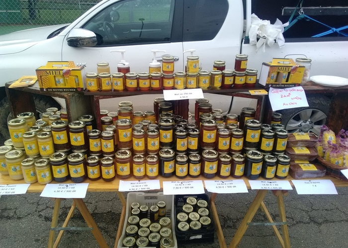
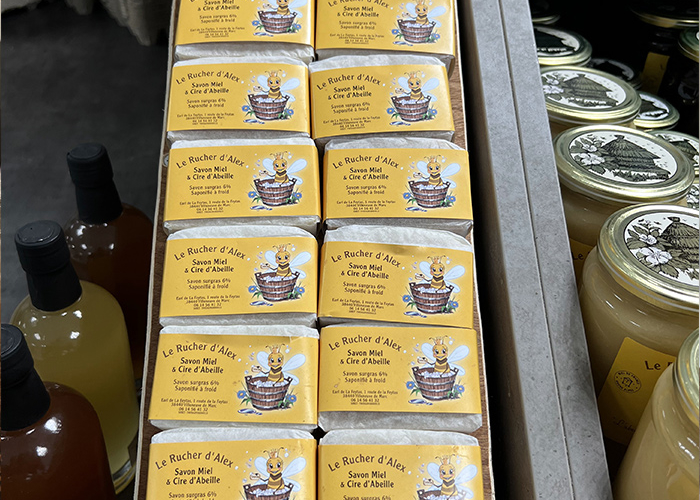

<h5>La commande groupée de bons produits à base de miel est terminée !</h5>
<h5>Récupération des commandes : </h5>
<h5>-> jeudi 6 février de 16h15 à 18h</h5>
<h5>-> à la grange à côté de l'école</h5>

  

Il y a bien sûr des pots de miel de plusieurs parfums (Lavande, Chataignier, Fleurs, Crémeux, Garrigue, Acacia), mais aussi des bonbons, des biscuits, gâteaux et même du savon.

Cette année, il n'y a plus de miel de Sapin et les rhums arrangés ne sont plus en commande mais un nouveau parfum apparait : Miel de Garrigue.

<h5>
Voici le bon de commande à nous retourner avant le vendredi 24 janvier inclus
pour une distribution fin janvier / début février :
</h5>
(Cliquer pour télécharger)

<h5>Vous allez vous régaler !</h5>

<table>
    <tr >
        <th width='300'>
          
        </th>
        <th width='300'>
          
        </th>        
      </tr>
      <tr>
        <th width='300'>
          
        </th>
        <th width='300'>
          
        </th>
      </tr>
  </table>

