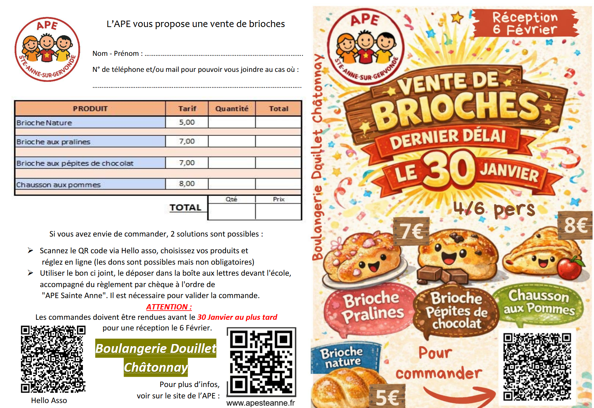

## 🍞 Opération Brioches  
### Une mission gourmande pour l’APE !

🎯 **Objectif de l’opération**  
Grâce à cette commande, petits et grands contribuent au financement des sorties scolaires pour vos enfants.

📅 **Date limite de commande** : **30 janvier**

📦 **Distribution des brioches**  
Le dernier jour d’école avant les vacances de février,  
**vendredi 6 février**

🤝 Nous comptons sur votre participation et vous remercions par avance pour votre soutien à cette action de l’APE ❤️

---

### 🛒 Commander en ligne (HelloAsso)

👉 Commandez avant le **30 janvier** pour une distribution avant les vacances de février :

<iframe
  id="haWidgetButton"
  allowtransparency="true"
  src="https://www.helloasso.com/associations/association-des-parents-d-eleves-de-l-ecole-publique-de-sainte-anne-sur-gervonde/boutiques/ape-ste-anne-vente-brioches-2026/widget-bouton"
  style={{ width: "100%", height: "70px", border: "none" }}
></iframe>

---

### 📝 Commander via le bon papier

Vous pouvez également utiliser le **bon de commande papier**, à nous retourner avant le **30 janvier**,  
accompagné du règlement, à déposer dans la boîte aux lettres de l’APE.

📄 **Télécharger le bon de commande**  

---

### 😋 Un grand merci… et à vos papilles !
