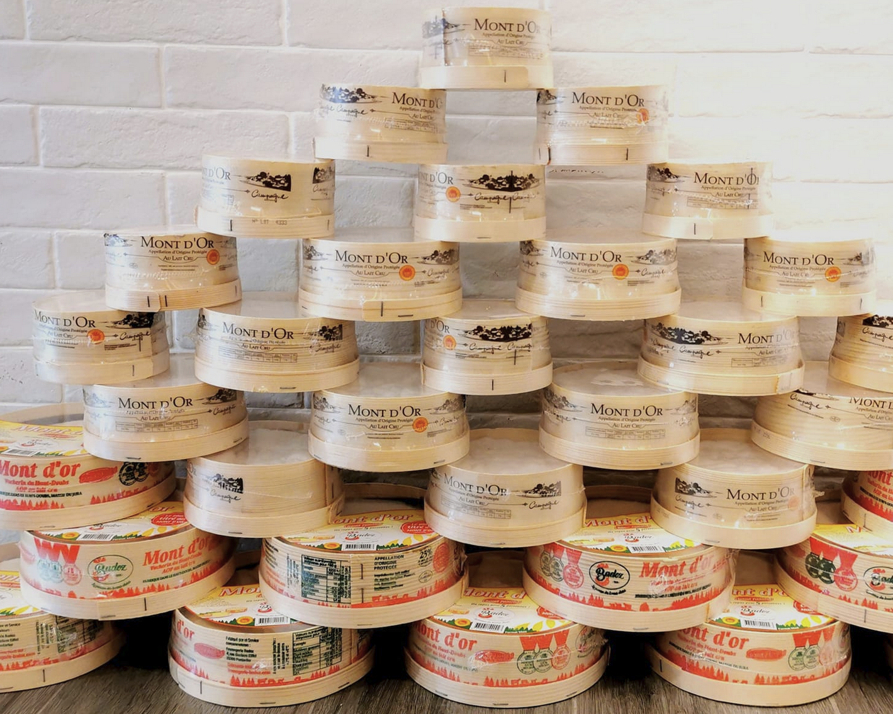

<h5>Une nouvelle commande groupée de bons fromages d'Arinthod est en cours :</h5>

Il y a bien sur du comté, du morbier, de la raclette, des monts d'or, des pots de cancoillotte, mais aussi leur spécialité, le "Moelleux d'Arinthod" qui a un peu la texture d'un reblochon.

Les produits à la coupe peuvent avoir des fluctuations de poids de 5%.

Possibilité de recevoir certains fromages sous vide avec un supplément de 0,50€ par produit. 

<h5>
Voici le lien pour commander sur Hello Asso avant le 6 Décembre 
pour une distribution avant les vacances de Noël :
  
<iframe id="haWidget" allowtransparency="true" src="https://www.helloasso.com/associations/association-des-parents-d-eleves-de-l-ecole-publique-de-sainte-anne-sur-gervonde/boutiques/ape-ste-anne-fromage-hiver-2025/widget-bouton" style="width: 100%; height: 70px; border: none;"></iframe>
</h5>
<h5>
Vous pouvez également utiliser ce bon de commande à nous retourner avant le 6 Décembre 
avec le règlement déposé dans la boîte aux lettres de l'APE :
</h5>
(Cliquer pour télécharger)

<h5>Vous allez vous régaler !</h5>

  

<table>
    <tr >
        <th width='300'>
          
        </th>
        <th width='300'>
          
        </th>        
      </tr>
      <tr>
        <th width='300'>
          
        </th>
        <th width='300'>
          
        </th>
      </tr>
  </table>

