

  Voici la liste des produits et leur tarif

  <table >
    <tr>
      <th>
        MADELAINES NATURE 
        <i>Madeleines nature 
        Présentation boîte carton 
        Dim. L. : 23,5 x l. : 19,5 x h. : 17,5 cm 
        Poids net : 880 g 
        50 emballages individuels</i>
      </th>
      <th>
        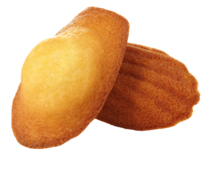
      </th>
      <th>10€</th>
    </tr>
    <tr>
      <th>
        MADELAINES CHOCOLAIT 
        <i>Madeleines nappées de chocolat au lait 
        Présentation boîte carton 
        Dim. L. : 23,5 x l. : 19,5 x h. : 17,5 cm 
        Poids net : 1080 g 
        50 emballages individuels </i>
      </th>
      <th>
        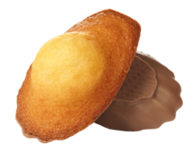
      </th>
      <th>10€</th>
    </tr>
    <tr>
      <th>
        MADELAINES CHOCONOIR 
        <i>Madeleines nappées de chocolat noir 
        Présentation boîte carton 
        Dim. L. : 23,5 x l. : 19,5 x h. : 17,5 cm 
        Poids net : 1080 g  
        50 emballages individuels </i>
      </th>
      <th>
        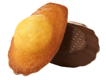
      </th>
      <th>10€</th>
    </tr>
    <tr>
      <th>
        MADELAINES PEPITES 
        <i>Madeleines aux pépites de chocolat 
        Présentation boîte carton 
        Dim. L. : 23,5 x l. : 19,5 x h. : 17,5 cm 
        Poids net : 900 g  
        50 emballages individuels </i>
      </th>
      <th>
        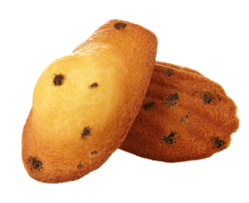
      </th>
      <th>10€</th>
    </tr>
    <tr>
      <th>
        FINANCIERS AMANDES 
        <i>Pâtisseries fondantes à la poudre d'amande aromatisées amande amère 
        Présentation boîte carton 
        Dim. L. : 23,5 x l. : 19,5 x h. : 8 cm 
        Poids net : 660 g  
        30 emballages individuels</i>
      </th>
      <th>
        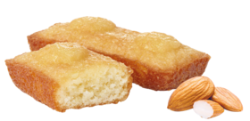
      </th>
      <th>10€</th>
    </tr>
    <tr>
      <th>
        FONDANTS CITRON 
        <i>Pâtisseries fondantes à la poudre d’amande et aux pépites au citron (7%) 
        Présentation boîte carton 
        Dim. L. : 23,5 x l. : 19,5 x h. : 8 cm 
        Poids net : 660 g  
        30 emballages individuels</i>
      </th>
      <th>
        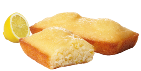
      </th>
      <th>10€</th>
    </tr>
    <tr>
      <th>
        FONDANTS CHOCOLOT 
        <i>Pâtisseries moelleuses au chocolat et à la poudre d’amande 
        Présentation boîte carton 
        Dim. L. : 23,5 x l. : 19,5 x h. : 8 cm 
        Poids net : 660 g  
        30 emballages individuels</i>
      </th>
      <th>
        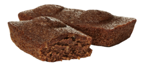
      </th>
      <th>10€</th>
    </tr>
    <tr>
      <th>
        LINGOTS POIRE CHOCONOIR 
        <i>Pâtisseries fondantes aux pépites de poire semi confites (14%) nappées de chocolat noir 
        Présentation boîte carton 
        Dim. L. : 23,5 x l. : 19,5 x h. : 8 cm 
        Poids net : 675 g 
        25 emballages individuels</i>
      </th>
      <th>
        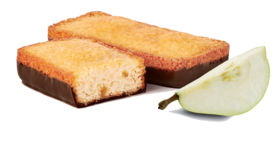
      </th>
      <th>10€</th>
    </tr>
    <tr>
      <th>
        GENOIS CHOCOLAIT 
        <i>Pâtisseries nappées de chocolat au lait 
        Présentation boîte carton 
        Dim. L. : 23,5 x l. : 19,5 x h. : 11,5 cm 
        Poids net : 920 g  
        30 emballages individuels</i>
      </th>
      <th>
        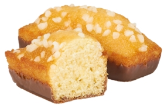
      </th>
      <th>10€</th>
    </tr>
    <tr>
      <th>
        CAKES FRUITS 
        <i>Pâtisseries aux fruits confits* (20%) et aux raisins secs au rhum (15%) 
        Présentation boîte carton 
        Dim. L. : 23,5 x l. : 19,5 x h. : 8 cm 
        Poids net : 600 g 
        20 emballages individuels</i>
      </th>
      <th>
        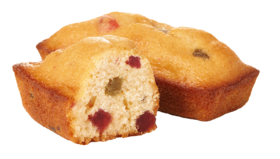
      </th>
      <th>10€</th>
    </tr>
    <tr>
      <th>
        BIJOU FRAISE 
        <i>Pâtisseries fourrées (24%) à la fraise 
        Présentation boîte carton 
        Dim. L. : 23,5 x l. : 19,5 x h. : 8 cm 
        Poids net : 660 g  
        20 emballages individuels</i>
      </th>
      <th>
        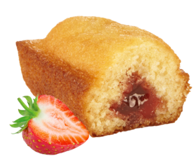
      </th>
      <th>10€</th>
    </tr>
    <tr>
      <th>
        BIJOU CARAMEL CHOCOLAIT 
        <i>Pâtisseries fourrées (21.6%) au lait et au caramel aromatisées caramel et nappées de chocolat au lait 
        Présentation boîte carton 
        Dim. L. : 23,5 x l. : 19,5 x h. : 8 cm 
        Poids net : 740 g 
        20 emballages individuels</i>
      </th>
      <th>
        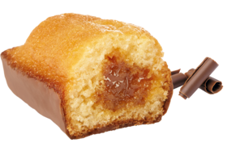
      </th>
      <th>10€</th>
    </tr>
    <tr>
      <th>
        BIJOU CACAO 
        <i>Pâtisseries fourrées (24%) au cacao 
        Poids net : 660 g 
        20 emballages individuels</i>
      </th>
      <th>
        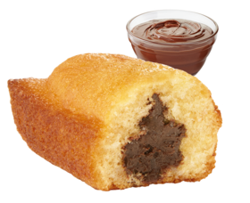
      </th>
      <th>10€</th>
    </tr>
    <tr>
        <th>
          FARANDOLE DE MADELAINES 
          <i>Assortiment de madeleines 
          Présentation boîte carton 
          Dim. L. : 23,5 x l. : 19,5 x h. : 11,5 cm 
          Poids net : 575 g 
          6x5 emballages individuels</i>
        </th>
        <th>
          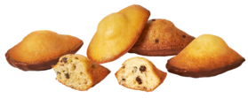
        </th>
        <th>10€</th>
      </tr>
      <tr>
        <th>
          PANACHE DE BIJOU FRUITS 
          <i>Pâtisseries fourrées (24%) aux fruits - 10 banane aromatisées banane, 10 framboise, 10 myrtille aromatisées myrtille 
          Une nouvelle composition régale les beaux jours gourmands. Notre Bijou Banane vient compléter cet assortiment. 
          Présentation boîte carton 
          Dim. L. : 23,5 x l. : 19,5 x h. : 11,5 cm 
          Poids net : 990 g 
          30 emballages individuels</i>
        </th>
        <th>
          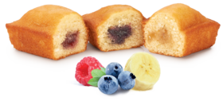
        </th>
        <th>10€</th>
      </tr>
      <tr>
        <th>
          BOUQUET DE PATISSERIES 
          <i>Assortiment de Pâtisseries 
          Présentation boîte carton 
          Dim. L. : 23,5 x l. : 19,5 x h. : 11,5 cm 
          Poids net : 850 g 
          30 emballages individuels</i>
        </th>
        <th>
          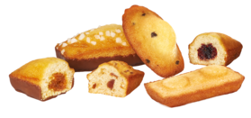
        </th>
        <th>10€</th>
      </tr>
      <tr>
        <th>
          MELI-MELO DE BISCUITS 
          <i>Assortiment de biscuits fins 
          Présentation boîte carton 
          Dim. L. : 23,5 x l. : 19,5 x h. : 11,5 cm 
          Poids net : 900 g 
          46 étuis de 2</i>
        </th>
        <th>
          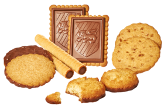
        </th>
        <th>10€</th>
      </tr>
  </table>

